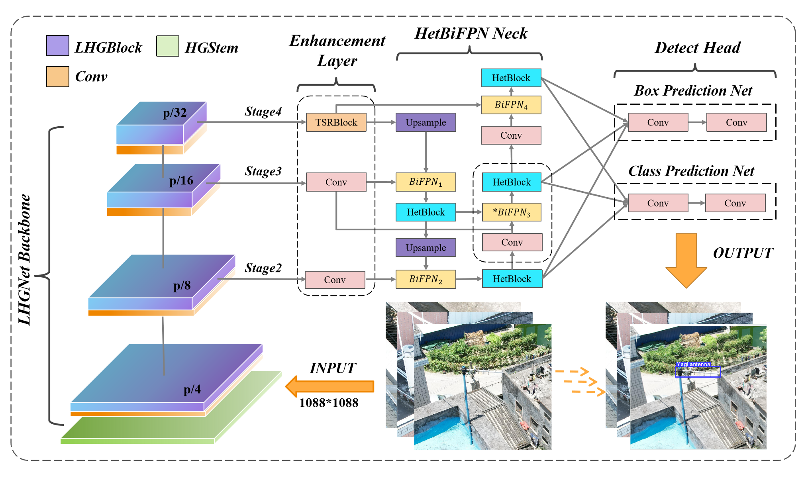
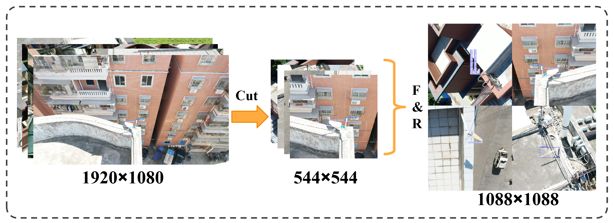
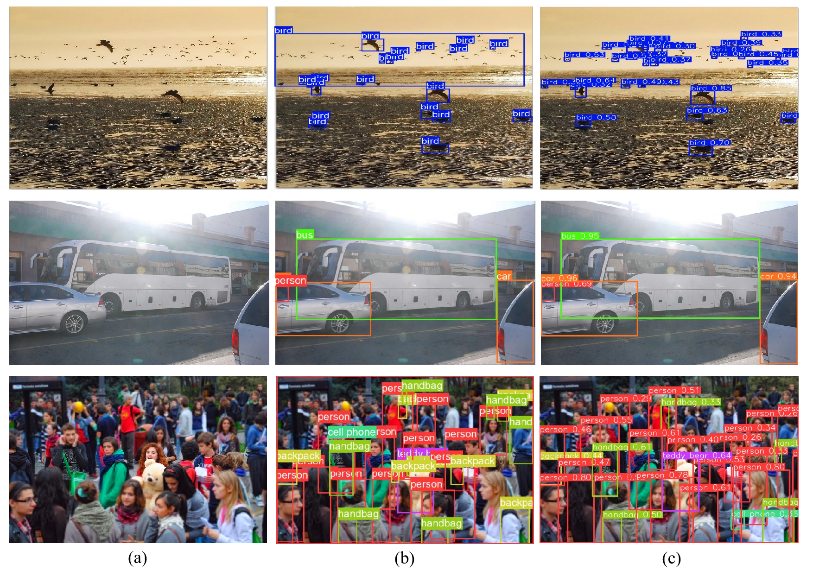

# [EdgeAnt](https://ieeexplore.ieee.org/document/10782998)

EdgeAnt is a new baseline end-to-end detector. It incorporates a lightweight backbone network named the Lightweight Hierarchical Geometric Network (LHGNet) and utilizes a neck network called the Heterogeneous Bidirectional Feature Pyramid Network (HetBiFPN). Furthermore, EdgeAnt features a Small Object Enhancement Layer (EL), which is composed of a Two-Segment Residual Block (TSRBlock) designed to improve the detection and understanding of small objects.

<p align="center">

</p>
<b><p align="center" style="margin-top: -20px;">
General framework diagram of EdgeAnt </b></p>

<p align="center">

</p>
<b><p align="center" style="margin-top: -20px;">
Video demo
</b></p>

[Real-Time AIoT for UAV Antenna Interference Detection via Edge-Cloud Collaboration](https://ieeexplore.ieee.org/document/10782998).\
Jun Dong, Jintao Cheng, Jin Wu, Chengxi Zhang, Shunyi Zhao, Xiaoyu Tang
[![MIT License][license-shield]][license-url]

<details>
  <summary>
  <font size="+1">Abstract</font>
  </summary>
In the fifth-generation (5G) era, eliminating communication interference sources is crucial for maintaining network performance. Interference often originates from unauthorized or malfunctioning antennas, and radio monitoring agencies must address numerous sources of such antennas annually. Unmanned aerial vehicles (UAVs) can improve inspection efficiency. However, the data transmission delay in the existing cloud-only (CO) artificial intelligence (AI) mode fails to meet the low latency requirements for real-time performance. Therefore, we propose a computer vision-based AI of Things (AIoT) system to detect antenna interference sources for UAVs. The system adopts an optimized edge-cloud collaboration (ECC+) mode, combining a keyframe selection algorithm (KSA), focusing on reducing end-to-end latency (E2EL) and ensuring reliable data transmission, which aligns with the core principles of ultra-reliable low-latency communication (URLLC). At the core of our approach is an end-to-end antenna localization scheme based on the tracking-by-detection (TBD) paradigm, including a detector (EdgeAnt) and a tracker (AntSort). EdgeAnt achieves state-of-the-art (SOTA) performance with a mean average precision (mAP) of 42.1% on our custom antenna interference source dataset, requiring only 3 million parameters and 14.7 GFLOPs. On the COCO dataset, EdgeAnt achieves 38.9% mAP with 5.4 GFLOPs. We deployed EdgeAnt on Jetson Xavier NX (TRT) and Raspberry Pi 4B (NCNN), achieving real-time inference speeds of 21.1 (1088) and 4.8 (640) frames per second (FPS), respectively. Compared with CO mode, the ECC+ mode reduces E2EL by 88.9%, increases accuracy by 28.2%. Additionally, the system offers excellent scalability for coordinated multiple UAVs inspections. The detector code is publicly available at https://github.com/SCNU-RISLAB/EdgeAnt.
</details>

## 📖How to use
### 📚Dataset

**Antenna Interference Source Dataset** was created in collaboration with communication professionals. Industrial UAVs were used to obtain aerial photographs for detector analysis and training tasks. We selected three significant antenna interference sources—Yagi, plate logs, and patch antennas—based on routine investigations conducted by the communication bureau. Since single small targets are often present within one aerial image, an image stitching strategy was employed to augment the dataset. Finally, the dataset was divided into a training set (600 images) and a validation set (200 images) at a ratio of 3:1, and professionals labeled the images.

<p align="center">

</p>
<b><p align="center" style="margin-top: -20px;">
Process of constructing the Antenna Interference Source Dataset </b></p>

Enter the address and label name of your data set in the [antenna.yaml](./ultralytics/cfg/datasets/antenna.yaml) which ensure that the dataset is used during the training process.

### 💾Environment
Our environment: Ubuntu 20.04, CUDA 11.4, NVIDIA RTX 3060 GPU.

Use conda to create the conda environment and activate it:
```shell
conda env create --name your_env_name python=3.8
conda activate your_env_name
pip install ultralytics
```
### 📈Training
Check the path in [train.py](./train.py), and run it to train:
```shell
python train.py 
```
### 📝Validation
Check the path in [val.py](./val.py).

```shell
python val.py
```

### 👀Performance

We present the visualization results of different methods on the Antenna Interference Source and COCO datasets in the figure below.

#### Single-frame visualization
<p align="center">

</p>
<b><p align="center" style="margin-top: -20px;">
Prediction results yielded by different detectors on the interference
source dataset. (b) Ground truth. (c) YOLOX-Nano. (d) YOLOv8-n (e) Our
method. </b></p>

<p align="center">

</p>
<b><p align="center" style="margin-top: -20px;">
Performance achieved by EdgeAnt in terms of reasoning about complex background images and images with intense lighting. (b) Ground truth. (c) Our method. </b></p>

## Acknowledgement

The code base is built with [ultralytics](https://github.com/ultralytics/ultralytics).

Thanks for the great implementations! 

## Citation

If our code or models help your work, please cite our paper:
```BibTeX
@ARTICLE{10782998,
  author={Dong, Jun and Cheng, Jintao and Wu, Jin and Zhang, Chengxi and Zhao, Shunyi and Tang, Xiaoyu},
  journal={IEEE Internet of Things Journal}, 
  title={Real-Time AIoT for UAV Antenna Interference Detection via Edge-Cloud Collaboration}, 
  year={2024},
  doi={10.1109/JIOT.2024.3512867}}
```

<!-- links -->
[license-shield]: https://img.shields.io/github/license/shaojintian/Best_README_template.svg?style=flat-square
[license-url]: https://github.com/shaojintian/Best_README_template/blob/master/LICENSE.txt


